## Themeify-Excalidraw

A simple CLI tool to make Excalidraw SVG exports **theme-aware** (supporting automatic light/dark mode) and **transparent**.

### Features

* **Automatic Theme Switching**: Injects CSS media queries (`prefers-color-scheme`) to swap colors based on browser/OS settings.
* **Transparency**: Removes the hardcoded white background rectangle generated by Excalidraw.
* **Smart Replacement**: Targets only default Excalidraw hex codes (`#1e1e1e` and `#ffffff`), leaving your custom accent colors untouched.
* **Font Fallbacks**: Ensures text renders correctly across different systems.

---

### Example

| Before (`test.svg`) | After (`test.theme.svg`) |
|---|---|
|  |  |

> The themed version adapts to your OS/browser color scheme. Elements with custom background colors (e.g. yellow, green) keep their original text color to preserve readability.

---

### Installation

1. Ensure you have [Rust and Cargo](https://rustup.rs/) installed.
2. Clone this repository or copy the `src/main.rs`.
3. Build the binary:
```bash
cargo build --release

```


4. (Optional) Move the binary to your path:
```bash
cp target/release/themeify /usr/local/bin/

```


---

### Usage

Pass the path of an Excalidraw SVG export to the tool:

```bash
themeify drawing.svg

```

**Output:** A new file named `drawing.theme.svg` will be created in the same directory.

---

### Implementation Note

For the dark mode CSS to function, the resulting SVG should be used:

* **Inlined** directly into your HTML.
* Loaded via an **`<object>`** tag:
```html
<object type="image/svg+xml" data="drawing.theme.svg"></object>

```

> [!NOTE]
> Standard `` tags may block the SVG from accessing system theme preferences for security reasons in some browsers.
